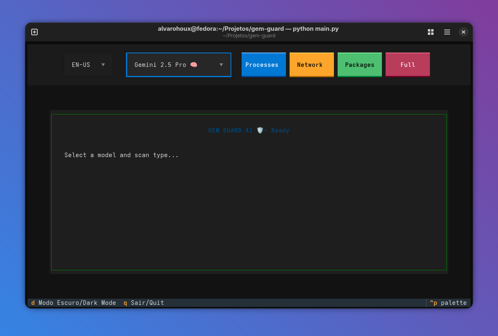
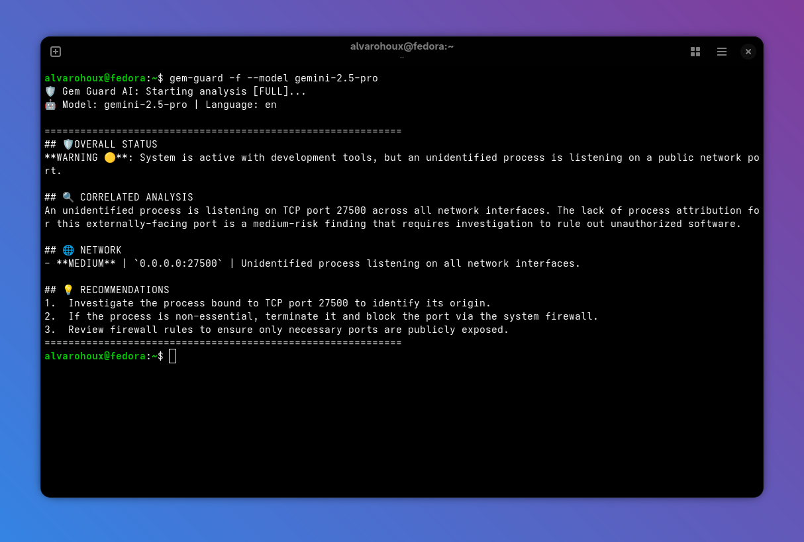
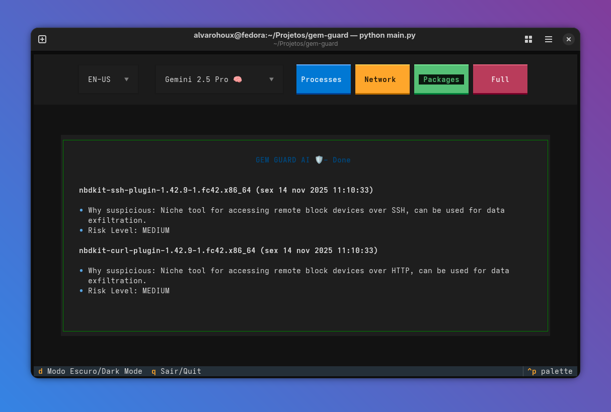
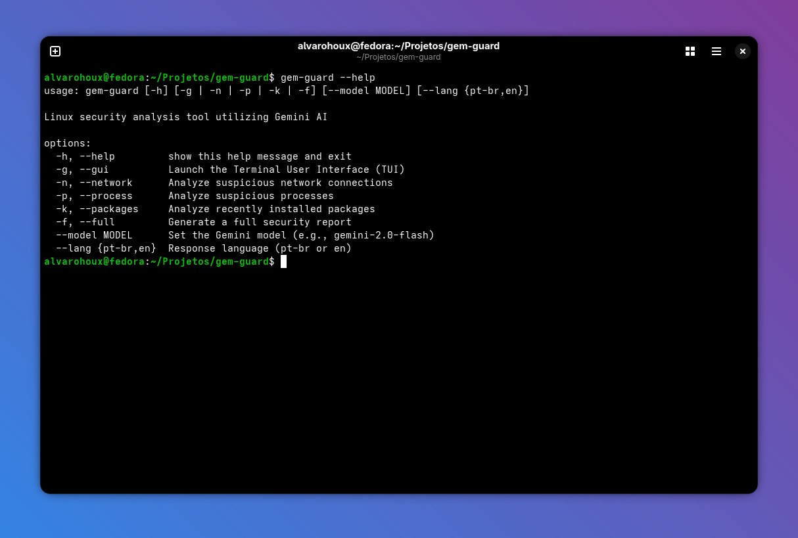

<h1 align="center">GemGuard AI 🛡️</h1>

**GemGuard AI** is a powerful terminal-based security analysis tool that brings AI-powered system auditing to Linux environments. Designed to be **distro-agnostic**, it supports **Fedora, Ubuntu, Debian, Kali Linux, and Alpine**, combining Google's advanced Gemini AI models with real-time system monitoring to deliver actionable security insights directly in your terminal.

<p align="center">
  
  
</p>


## ✨ Why GemGuard AI?

Traditional security tools often require deep technical expertise to interpret. GemGuard AI bridges this gap by using artificial intelligence to analyze system data and explain potential threats in plain language, making enterprise-grade security accessible to everyone.

## 🚀 Key Features

- **🤖 AI-Powered Intelligence**: Leverages Gemini 1.5 Flash, Pro, and 2.0 models to transform raw system logs into clear, actionable security recommendations
- **🖥️ Smart Process Monitoring**: Analyzes CPU-intensive processes, detecting obfuscated names, privilege escalations, and suspicious behaviors
- **📦 Adaptive Package Analysis**: Automatically detects your package manager (`dnf`, `apt`/`dpkg`, or `apk`) to review recently installed software, identifying unauthorized binaries and bloatware
- **🌐 Network Security Auditing**: Examines active connections using `ss` to identify unauthorized ports, suspicious remote IPs, and potential data exfiltration
- **🌍 Multilingual Interface**: Complete support for English (EN-US) and Portuguese (PT-BR), including localized reports and diagnostics
- **🎨 Modern Terminal UI**: Beautiful interface powered by Textual, featuring dark mode, smooth animations, and intuitive mouse support
- **⚡ Flexible Model Selection**: Switch between Gemini models on the fly—use Flash for quick scans or Pro for in-depth analysis
- **📊 Comprehensive Reporting**: Generate full system security reports that cross-reference processes, network activity, and package installations
- **🔧 CLI Mode**: Run analyses directly from the command line without the TUI for automation and scripting

<p align="center">
  
</p>

## 🛠️ Prerequisites

| Requirement | Details |
|------------|---------|
| **Operating System** | Linux (Verified on **Fedora, Ubuntu, Debian, Kali, Alpine**) |
| **Python Version** | 3.10 or higher |
| **API Access** | Valid Google AI Studio API key ([Get one here](https://makersuite.google.com/app/apikey)) |
| **System Commands** | `ps`, `ss` (universal) AND one package manager: `rpm`, `dpkg`, or `apk` |

## 📥 Installation

### Method 1: Install with pipx (Recommended for Ubuntu/Debian)
Modern distributions like Ubuntu 24.04+ restrict global pip usage. `pipx` is the cleanest way to install:

```bash
# Install pipx (if not installed)
sudo apt install pipx  # Debian/Ubuntu/Kali
sudo dnf install pipx  # Fedora

# Install GemGuard globally
pipx install git+[https://github.com/AlvaroHoux/gem-guard.git](https://github.com/AlvaroHoux/gem-guard.git)

# Run from anywhere
gem-guard
```

### Method 2: Install as Global Command (Fedora/Dev Mode)

```bash
# Clone the repository
git clone [https://github.com/AlvaroHoux/gem-guard.git](https://github.com/AlvaroHoux/gem-guard.git)
cd gem-guard

# Install in development mode (creates global 'gem-guard' command)
pip install -e .

# Verify installation
gem-guard --help
``

### Method 3: Virtual Environment (Manual)

```bash

# Clone the repository
git clone [https://github.com/AlvaroHoux/gem-guard.git](https://github.com/AlvaroHoux/gem-guard.git)
cd gem-guard

# Create and activate virtual environment
python3 -m venv .venv
source .venv/bin/activate

# Install dependencies
pip install -e .

# Use gem-guard
gem-guard
```

## ⚙️ Configuration

1. **Create environment file** in the project directory:
   ```bash
   cd gem-guard
   cp .env.example .env
   ```

2. **Edit `.env` and add your API key:**
   ```env
   GEMINI_API_KEY=your_actual_api_key_here
   ```

## 🚀 Usage

### Interactive TUI Mode (Default)

```bash
# Launch the full terminal user interface
gem-guard
```

### CLI Mode (Command Line)

<p align="center">
  
</p>

### Interface Guide (TUI Mode)

| Element | Function |
|---------|----------|
| **Language Selector** | Choose between 🇧🇷 PT-BR and 🇺🇸 EN-US |
| **Model Dropdown** | Select AI model (Flash/Pro/2.0) based on speed vs. depth needs |
| **Processes/Processos** | Audit running tasks and identify suspicious processes |
| **Network/Rede** | Analyze network connections and detect unauthorized access |
| **Packages/Pacotes** | Review recent software installations |
| **Full/Relatório** | Generate comprehensive security report |

---

## ⚠️ Important Disclaimers

**GemGuard AI is an assistive tool, not a replacement for professional security audits.**

- 🧠 **AI Limitations**: Large language models can occasionally produce false positives or miss sophisticated threats. Always verify critical alerts manually
- 🔍 **Manual Verification**: Cross-reference findings with standard Linux tools: `top`, `htop`, `netstat`, `wireshark`, `auditd`, `rkhunter`
- 📋 **Use Case**: Ideal for initial security assessments, educational purposes, and routine monitoring—not for mission-critical production environments without validation
- ⚖️ **Liability**: The developers assume no responsibility for actions taken based solely on AI-generated recommendations
- 🏠 **Development Systems**: Prompts are optimized for developer workstations; production servers may require custom prompt tuning

## 🤝 Contributing

We welcome contributions from the community! Whether it's bug fixes, new features, or documentation improvements, your help makes GemGuard AI better for everyone.

### How to Contribute

1. **Fork** the repository
2. **Create** a feature branch
   ```bash
   git checkout -b feature/AmazingSecurityFeature
   ```
3. **Commit** your changes with clear messages
   ```bash
   git commit -m 'Add advanced port scanning detection'
   ```
4. **Push** to your branch
   ```bash
   git push origin feature/AmazingSecurityFeature
   ```
5. **Open** a Pull Request with a detailed description

### Contribution Ideas

- 🏹 Support for Arch Linux (Pacman) and Zypper (OpenSUSE)
- 🔌 Integration with SIEM tools and security frameworks
- 📊 Enhanced visualization and reporting features (HTML/PDF exports)
- 🌐 Additional language translations (Spanish, French, German)
- 🧪 Unit tests and integration tests
- 🔐 Analysis of SELinux/AppArmor policies
- 📦 Support for Snap and AppImage package formats
- 🤖 Integration with other AI models (Claude, GPT, local LLMs)

## 📄 License

This project is licensed under the **MIT License**. See the [LICENSE](LICENSE) file for complete details.