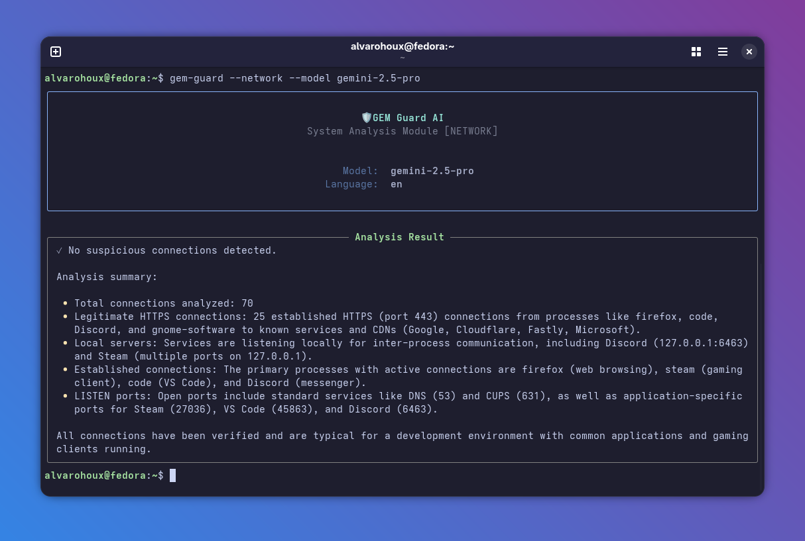
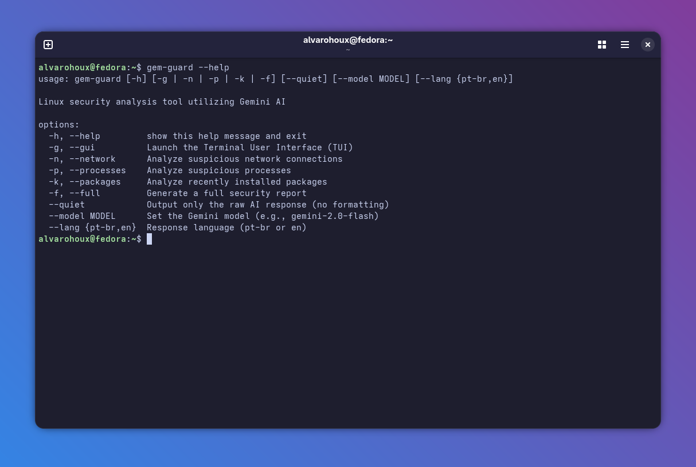

<h1 align="center">GemGuard AI 🛡️</h1>

**GemGuard AI** is a powerful terminal-based security analysis tool that brings AI-powered system auditing to Linux and Windows environments. Designed to be **truly cross-platform**, it supports **Fedora, Ubuntu, Debian, Kali Linux, Alpine, and Windows 10/11**, combining Google's advanced Gemini AI models with system monitoring to deliver actionable security insights directly in your terminal.

<p align="center">
  
  
</p>


## ✨ Why GemGuard AI?

Traditional security tools often require deep technical expertise to interpret. GemGuard AI bridges this gap by using artificial intelligence to analyze system data and explain potential threats in plain language, making enterprise-grade security accessible to everyone—whether you are running a Linux server or a Windows workstation.

## 🚀 Key Features

- **🤖 AI-Powered Intelligence**: Leverages Gemini 2.5 Flash, Pro, and 3.0 models to transform raw system logs into clear, actionable security recommendations
- **🪟 Cross-Platform Support**: Seamlessly runs on **Linux** (Bash/Zsh) and **Windows** (CMD/PowerShell), automatically adapting commands
- **🖥️ Smart Process Monitoring**: Analyzes CPU-intensive processes, detecting obfuscated names and suspicious behaviors using `ps` (Linux) or `tasklist` (Windows)
- **📦 Adaptive Package Analysis**: Automatically detects your package manager (`dnf`, `apt`, `apk`, or `winget`) to review recently installed software
- **🌐 Network Security Auditing**: Examines active connections using `ss` (Linux) or `netstat` (Windows) to identify unauthorized ports and suspicious remote IPs
- **🌍 Multilingual Interface**: Complete support for English (EN-US), Portuguese (PT-BR), and Simplified Chinese (ZH-CN), including localized reports and diagnostics
- **🎨 Modern Terminal UI**: Beautiful interface powered by Textual, featuring dark mode, smooth animations, and intuitive mouse support
- **⚡ Flexible Model Selection**: Switch between Gemini models on the fly—use Flash for quick scans or Pro for in-depth analysis
- **📊 Comprehensive Reporting**: Generate full system security reports that cross-reference processes, network activity, and package installations
- **📝 Exportable Reports**: Turn every scan into shareable HTML/PDF artifacts that bundle AI insights with raw telemetry snapshots
- **🔧 CLI Mode**: Run analyses directly from the command line without the TUI for automation and scripting

<p align="center">
  
</p>

## 🛠️ Prerequisites

| Requirement | Details |
|------------|---------|
| **Operating System** | **Linux** (Fedora, Ubuntu, Debian, Kali, Alpine) OR **Windows** (10/11) |
| **Python Version** | 3.10 or higher |
| **API Access** | Valid Google AI Studio API key ([Get one here](https://makersuite.google.com/app/apikey)) |
| **System Commands** | **Linux:** `ps`, `ss`, `rpm`/`dpkg`/`apk` <br> **Windows:** `tasklist`, `netstat`, `winget` |

## 📥 Installation

### Method 1: Linux (pipx recommended)

```bash
# Debian/Ubuntu/Kali
sudo apt install pipx
pipx install git+https://github.com/AlvaroHoux/gem-guard.git

# Fedora
sudo dnf install pipx
pipx install git+https://github.com/AlvaroHoux/gem-guard.git

# Run
gem-guard
````

### Method 2: Windows (PowerShell or CMD)

1.  **Clone the repository:**

```powershell
git clone "https://github.com/AlvaroHoux/gem-guard.git"
cd gem-guard
```

2.  **Create and activate Virtual Environment:**

```powershell
python -m venv .venv
.\.venv\Scripts\activate
```

3.  **Install:**

    ```powershell
    pip install -e .
    ```

4.  **Run:**

    ```powershell
    gem-guard
    ```

### Method 3: Linux Manual (Dev Mode)

```bash
git clone "https://github.com/AlvaroHoux/gem-guard.git"
cd gem-guard
python3 -m venv .venv
source .venv/bin/activate
pip install -e .
gem-guard
```

## ⚙️ Configuration

1.  **Create environment file** in the project directory:

      * **Linux:** `cp .env.example .env`
      * **Windows:** `copy .env.example .env`

2.  **Edit `.env` and add your API key:**

    ```env
    GEMINI_API_KEY=your_actual_api_key_here
    ```

## 🚀 Usage

### Interactive TUI Mode (Default)

```bash
# Launch the full terminal user interface
gem-guard
```

### CLI Mode (Command Line)

\<p align="center"\>
\
\</p\>

### Report Exports (HTML/PDF)

**CLI:** add `--export html` and/or `--export pdf` when running any mode. Files are written to `./reports` by default, but you can change this with `--export-dir` and override the base filename with `--export-name`.

```bash
# Example: full scan with both formats
gem-guard --full --lang zh-cn --model gemini-2.5-pro \
  --export html --export pdf --export-dir ~/security-reports
```

> **Note:** PDF export relies on WeasyPrint. Most Linux distributions require Cairo/Pango libraries; install them via the package manager if you encounter system-level dependency errors.

**TUI:** after a scan finishes, the toolbar exposes “Export HTML” and “Export PDF” buttons (localized per language). Clicking either writes the artifact to the same `./reports` folder and pops a notification indicating the saved path.

### Interface Guide (TUI Mode)

| Element | Function |
|---------|----------|
| **Language Selector** | Choose between 🇧🇷 PT-BR, 🇺🇸 EN-US, and 🇨🇳 ZH-CN |
| **Model Dropdown** | Select AI model (Flash/Pro/2.0) based on speed vs. depth needs |
| **Processes/Processos** | Audit running tasks and identify suspicious processes |
| **Network/Rede** | Analyze network connections and detect unauthorized access |
| **Packages/Pacotes** | Review recent installations (Auto-detects OS Package Manager) |
| **Full/Relatório** | Generate comprehensive security report |
| **Export Buttons** | Save the latest scan as HTML or PDF for sharing |

-----

## ⚠️ Important Disclaimers

**GemGuard AI is an assistive tool, not a replacement for professional security audits.**

  - 🧠 **AI Limitations**: Large language models can occasionally produce false positives or miss sophisticated threats. Always verify critical alerts manually
  - 🔍 **Manual Verification**: Cross-reference findings with standard tools (`top`/`htop` on Linux, Task Manager/Resource Monitor on Windows)
  - 📋 **Use Case**: Ideal for initial security assessments, educational purposes, and routine monitoring—not for mission-critical production environments without validation
  - ⚖️ **Liability**: The developers assume no responsibility for actions taken based solely on AI-generated recommendations
  - 🏠 **Development Systems**: Prompts are optimized for developer workstations; production servers may require custom prompt tuning

## 🤝 Contributing

We welcome contributions from the community\! Whether it's bug fixes, new features, or documentation improvements, your help makes GemGuard AI better for everyone.

### How to Contribute

1.  **Fork** the repository
2.  **Create** a feature branch
    ```bash
    git checkout -b feature/AmazingSecurityFeature
    ```
3.  **Commit** your changes with clear messages
    ```bash
    git commit -m 'Add advanced port scanning detection'
    ```
4.  **Push** to your branch
    ```bash
    git push origin feature/AmazingSecurityFeature
    ```
5.  **Open** a Pull Request with a detailed description

### Contribution Ideas

  - 🏹 Support for Arch Linux (Pacman) and Zypper (OpenSUSE)
  - 🔌 Integration with SIEM tools and security frameworks
  - 🌐 Additional language translations (Spanish, French, German)
  - 🧪 Unit tests and integration tests
  - 🔐 Analysis of SELinux/AppArmor policies
  - 📦 Support for Snap, AppImage, and Chocolatey (Windows) packages
  - 🤖 Integration with other AI models (Claude, GPT, local LLMs)

## 📄 License

This project is licensed under the **MIT License**. See the [LICENSE](./LICENSE) file for complete details.
